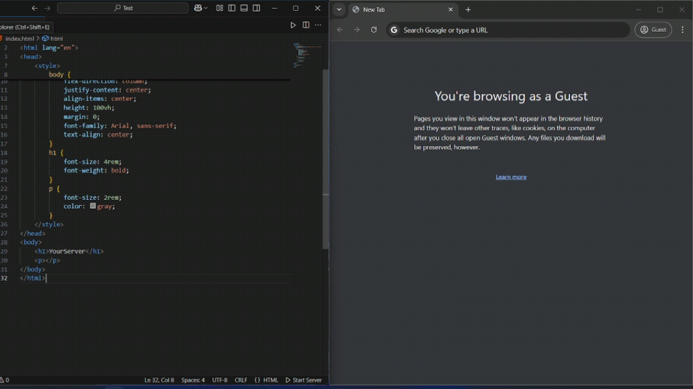
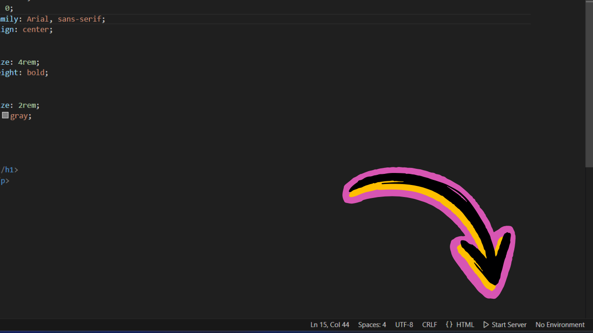
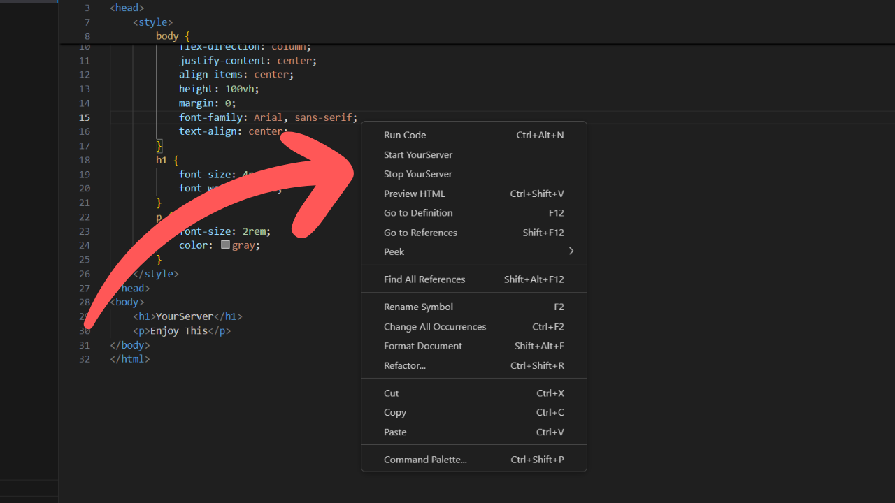

# YourServer - VS Code Extension

YourServer is a lightweight Visual Studio Code extension that provides an easy way to launch a local development server with live reloading. It is built using `live-server` and allows you to preview HTML files instantly.

## Features

- One-click start/stop server from the status bar.
- Automatically finds an available port (starting from `5500`).
- Opens your project in the browser automatically.
- Supports live reloading when files change.
- Works from both the Explorer and Editor context menus.

## Installation

1. Open VS Code.
2. Go to **Extensions** (`Ctrl+Shift+X` or `Cmd+Shift+X` on macOS).
3. Search for `YourServer`.
4. Click **Install**.

Alternatively, install via the command line:

```sh
code --install-extension NSTechBytes.yourserver
```
## Preview



## Usage

### Start the Server

- Click on the **Start Server** button in the status bar.
- Or right-click in the **Explorer** or **Editor** and select **Start YourServer**.



### Stop the Server

- Click on the **Stop Server** button in the status bar.
- Or right-click in the **Explorer** or **Editor** and select **Stop YourServer**.



## Commands

| Command              | Description             |
| -------------------- | ----------------------- |
| `yourserver.start` | Starts the local server |
| `yourserver.stop`  | Stops the server        |

## Configuration

YourServer automatically detects an available port starting from `5500`. You can modify the default behavior in future updates by adding settings support.

## Requirements

- Visual Studio Code `v1.97.0` or later.

## Repository

[GitHub Repository](https://github.com/NSTechBytes/yourserver-vscode-extension)

## Issues & Feedback

If you encounter any issues or have feature requests, please open an issue on [GitHub Issues](https://github.com/NSTechBytes/yourserver-vscode-extension/issues).

## License

This extension is licensed under the Apache License.


## Contribution 🤝

Feel free to contribute to the development of RainSyntax! Follow these steps:

1. Fork this repository.
2. Clone the forked repository to your local machine.
3. Make your changes and test them.
4. Create a pull request explaining your changes.

---

## Feedback and Support 📩

If you encounter any issues or have suggestions for improvement, please [open an issue](https://github.com/NSTechBytes/yourserver-vscode-extension/issues) on GitHub. Your feedback is invaluable!
